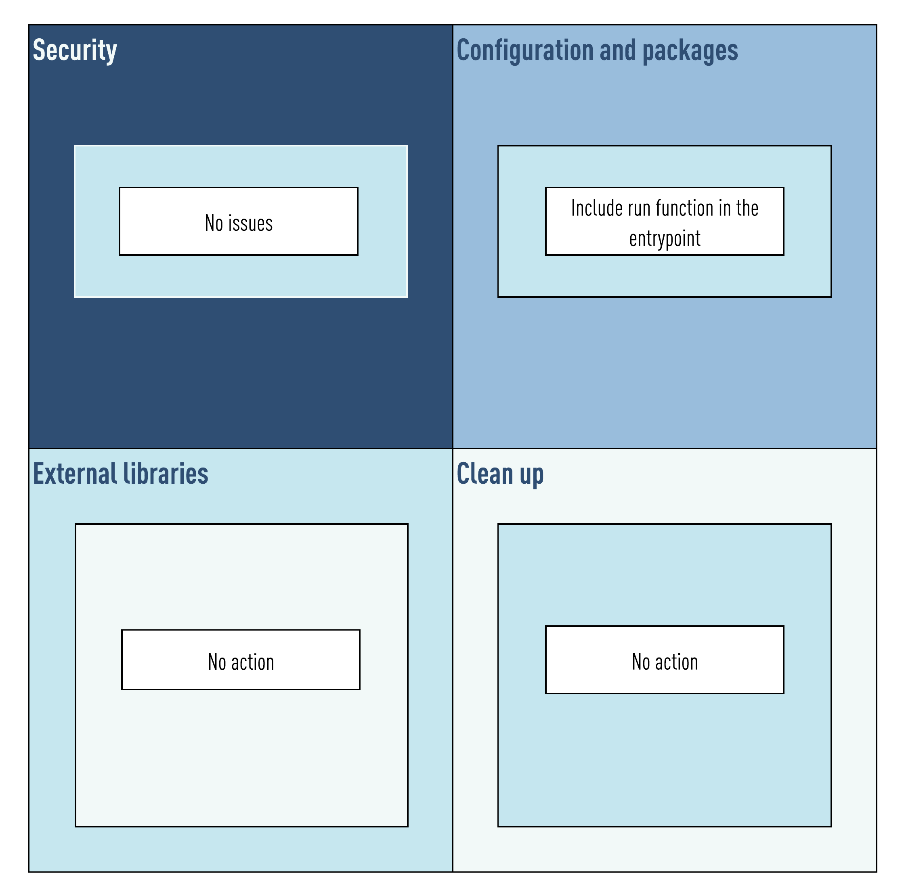

# Welcome

 

Welcome to the Seltris project. This image is part of the [k8sb](https://github.com/v8tix/k8sb) project.

#### Prerequisites
* Docker Engine installed.

## What this guide covers
1. The Seltris image contexts.
2. Seltris configuration.
3. Common operations.
### 1. The Seltris image contexts.
* The following figure shows these contexts:

* In this case Seltris only uses one context: 
  * Configuration and packages: 
    * Seltris adds a special function that lets you run a Spring Boot application from its Entry Point.  
* :bulb: You can use Seltris on production environments.    
### 2. Seltris configuration.
* :exclamation: Under the configuration directory you will find a file called const.sh. Please review this file carefully and make the necessary changes.  
* Each constant is described below:
  * HOST_PORT: The TCP port on the Docker host. By default, this setting is 8080.
  * CNTR_PORT: The TCP port on the Docker container. By default, this setting is 8080.
  * HOST_MICROSERVICE_DIR: The host directory where Docker will search for your artifacts. 
    * Inside this directory you must create two subdirectories:
      * fatjar: Place your compiled artifact here.  
      * config: Your configuration file needed by your fatjar must be here.
  * CNTR_MICROSERVICE_DIR: The container directory where Docker will mount your artifacts.
  * FATJAR_NAME: The compiled artifact name.      
  * JAVA_IO_DIR: The [Java temporary directory](https://examples.javacodegeeks.com/core-java/io/java-io-tmpdir-example/) needed by the JVM. Take a look to the Docker file before modifying this constant. 
### 3. Common operations.
* At the root directory you will find the following directories.
  * configuration:
    * Here you can change the image name and its tag. 
  * build.
    * The Docker file, and the container artifacts need must be included here.
    * Also in this directory you can find the build.sh script. Execute it if you plan to build this image. 
    * Once the image was built, you can go to the executables directory.
  * executables.
    * Each script under this directory wraps a useful Docker command.
    * To give it a try:
      * You need a Spring Boot application first. The [Social](https://github.com/v8tix/social) microservice is a good fit.
      * Be sure you accomplished all the requirements described in step 2.
      * Now, you can execute the run.sh script. This will start a detached container.
        * To get a console, execute the attach.sh script.
        * :bulb: Like in SSH connections, type 'exit' and then press Enter to close the console.
      * When you are done, there are two ways to stop it:
        * If you want to stop it, and keep this image, execute the stop.sh script,         
        * Otherwise execute the delete.sh script instead.
## Authors
* Initial work

 
&nbsp;&nbsp;&nbsp;&nbsp;&nbsp;&nbsp;&nbsp;[Contact us](mailto:info@v8tix.com)

## License  
<a rel="license" href="http://creativecommons.org/licenses/by/4.0/">&nbsp;</a>This work is licensed under a [Creative Commons Attribution 4.0 International License](http://creativecommons.org/licenses/by/4.0/).  
  

 